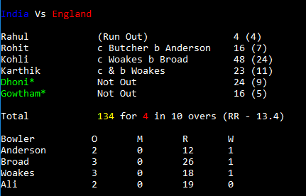

# Task description

Build a cricket scorecard program in nodeJs using TypeScript.
1.  The input to the program would be an array of objects with each object having the details of the ball bowled.
2. The first object would have details of the first ball bowled, the second object for the second ball bowled and so on.
3. The input format is given below.

# Input Format

The following is a sample input format. Please add more objects if you need to populate more data.
```
[
    {
        runsScored: 0,
        isOut: true,
        dismissalType: 'Run Out',
        dismissalInfo: {
            fielderName: 'Root',
            hasBatsmanCrossed: true,
            batsmanOut: striker | non-striker,
        },
        batsmanName: 'Rahul',
        bowlerName: 'Anderson'
    },
    {
        runsScored: 1,
        isOut: false,
        batsmanName: 'Rohit',
        bowlerName: 'Anderson'
    },
    {
        runsScored: 4,
        isOut: false,
        batsmanName: 'Kohli',
        bowlerName: 'Anderson'
    },
    ... --> More balls bowled
    {
        runsScored: 0,
        isOut: false,
        isExtra: true,
        extraType: 'byes'
        extraInfo: {
            runsOffered: 2
        }
        batsmanName: 'Kohli',
        bowlerName: 'Anderson'
    },
    {
        runsScored: 0,
        isOut: true,
        dismissalType: 'Caught',
        dismissalInfo: {
            fielderName: 'Butcher',
            hasBatsmanCrossed: false
        }
        batsmanName: 'Kohli',
        bowlerName: 'Broad'
    }
    ... --> More balls bowled
]

```

# Output
The following should be printed to the console on running the program.



# Points to note
1. Use Object Oriented Principles while designing.
2. Use [Chalk](https://github.com/chalk/chalk) to format in console.
3. Use ES6 style syntax.
4. Write specs for your program.

# Folder structure to be followed
1. Place/Organize your typescript files under a file called src.
2. Use tsconfig.json to configure typescript and make it generate all the JavaScript files under dist folder.
3. Create a spec folder and place all your spec files inside it