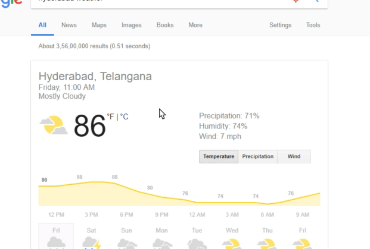

# Task description

1. Build a weather app emulating the google weather app as shown below.

# Points to note
1. Make the UI look as close to the actual.
2. Sign up in [openweathermap](https://openweathermap.org/api) to get your own keys. 
3. Use jquery for DOM manipulation
4. Use ES6 style syntax.

# Folder structure to be followed
1. Inside this folder, create the index.html.
2. Place your css, fonts file under a folder called css.
3. Place your js file  under a folder called js.
4. Place any images under a folder called images.
5. Create other html files and link them to js/css/other htmls appropriately.